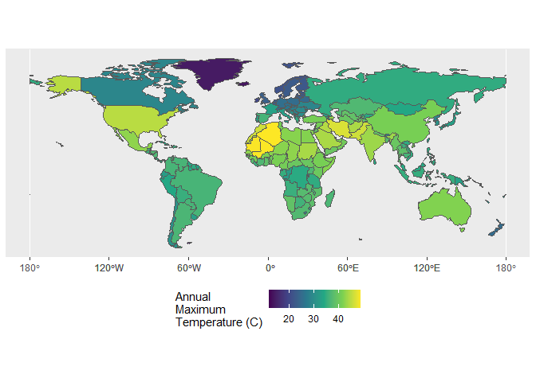

Case Study 06
================
Your Name
August 1, 2020

``` r
library(raster)
library(sp)
library(spData)
library(tidyverse)
library(sf)
library(dplyr)
```

``` r
data(world)
tmax_monthly <- getData(name = "worldclim", var = "tmax", res = 10)


world_data <- world %>% 
  filter(continent != "Antarctica") %>% 
  as("Spatial")

gain(tmax_monthly) <- 0.1
tmax_annual <- max(tmax_monthly)
names(tmax_annual) <- "tmax"

temp_max <- raster::extract(tmax_annual, world_data, fun = max, na.rm = TRUE, small = TRUE, sp = TRUE) %>% 
  st_as_sf()

ggplot(temp_max) + 
  geom_sf(aes(fill = tmax)) + 
  scale_fill_viridis_c(name = "Annual\nMaximum\nTemperature (C)") +
  theme(legend.position = 'bottom')
```

<!-- -->

``` r
temp_max %>% 
  st_set_geometry(NULL) %>% 
  select(name_long, continent, tmax) %>% 
  group_by(continent) %>% 
  top_n(1) %>% 
  arrange(desc(tmax))
```

    ## Selecting by tmax

    ## # A tibble: 7 x 3
    ## # Groups:   continent [7]
    ##   name_long                           continent                tmax
    ##   <chr>                               <chr>                   <dbl>
    ## 1 Algeria                             Africa                   48.9
    ## 2 Iran                                Asia                     46.7
    ## 3 United States                       North America            44.8
    ## 4 Australia                           Oceania                  41.8
    ## 5 Argentina                           South America            36.5
    ## 6 Spain                               Europe                   36.1
    ## 7 French Southern and Antarctic Lands Seven seas (open ocean)  11.8
