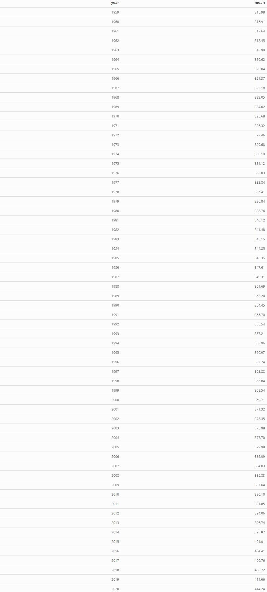

case study 8
================
Ziqi Tang
2021/10/25

``` r
library(rmarkdown)
library(tidyverse)
library(kableExtra)
```

``` r
co2_annmean <- read_table("ftp://aftp.cmdl.noaa.gov/products/trends/co2/co2_annmean_mlo.txt",skip = 56)
```

    ## 
    ## -- Column specification --------------------------------------------------------
    ## cols(
    ##   `#` = col_double(),
    ##   year = col_double(),
    ##   mean = col_double(),
    ##   unc = col_character()
    ## )

``` r
colnames(co2_annmean) <- c('year','mean','unc')
co2_annmean
```

    ## # A tibble: 62 x 4
    ##     year  mean   unc ``   
    ##    <dbl> <dbl> <dbl> <chr>
    ##  1  1959  316.  0.12 <NA> 
    ##  2  1960  317.  0.12 <NA> 
    ##  3  1961  318.  0.12 <NA> 
    ##  4  1962  318.  0.12 <NA> 
    ##  5  1963  319.  0.12 <NA> 
    ##  6  1964  320.  0.12 <NA> 
    ##  7  1965  320.  0.12 <NA> 
    ##  8  1966  321.  0.12 <NA> 
    ##  9  1967  322.  0.12 <NA> 
    ## 10  1968  323.  0.12 <NA> 
    ## # ... with 52 more rows

``` r
ggplot(co2_annmean,aes(x = year,y = mean))+
  geom_line()
```

<!-- -->

``` r
co2_annmean[1:2] %>% 
  kable() %>% 
  kable_styling() %>%
  as_image(width = 10,file = "table.jpg")
```


