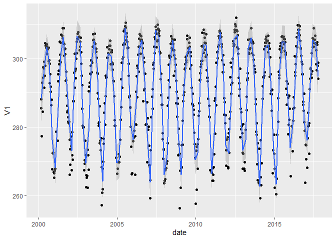

Case Study 10
================
Ziqi Tang
August 1, 2020

``` r
library(raster)
```

    ## 载入需要的程辑包：sp

``` r
library(rasterVis)
```

    ## 载入需要的程辑包：lattice

``` r
library(rgdal)
```

    ## Please note that rgdal will be retired by the end of 2023,
    ## plan transition to sf/stars/terra functions using GDAL and PROJ
    ## at your earliest convenience.
    ## 
    ## rgdal: version: 1.5-26, (SVN revision 1148)
    ## Geospatial Data Abstraction Library extensions to R successfully loaded
    ## Loaded GDAL runtime: GDAL 3.2.1, released 2020/12/29
    ## Path to GDAL shared files: D:/R-4.1.1/library/rgdal/gdal
    ## GDAL binary built with GEOS: TRUE 
    ## Loaded PROJ runtime: Rel. 7.2.1, January 1st, 2021, [PJ_VERSION: 721]
    ## Path to PROJ shared files: D:/R-4.1.1/library/rgdal/proj
    ## PROJ CDN enabled: FALSE
    ## Linking to sp version:1.4-5
    ## To mute warnings of possible GDAL/OSR exportToProj4() degradation,
    ## use options("rgdal_show_exportToProj4_warnings"="none") before loading sp or rgdal.
    ## Overwritten PROJ_LIB was D:/R-4.1.1/library/rgdal/proj

``` r
library(ggmap)
```

    ## 载入需要的程辑包：ggplot2

    ## Google's Terms of Service: https://cloud.google.com/maps-platform/terms/.

    ## Please cite ggmap if you use it! See citation("ggmap") for details.

``` r
library(tidyverse)
```

    ## -- Attaching packages --------------------------------------- tidyverse 1.3.1 --

    ## v tibble  3.1.4     v dplyr   1.0.7
    ## v tidyr   1.1.3     v stringr 1.4.0
    ## v readr   2.0.1     v forcats 0.5.1
    ## v purrr   0.3.4

    ## -- Conflicts ------------------------------------------ tidyverse_conflicts() --
    ## x tidyr::extract() masks raster::extract()
    ## x dplyr::filter()  masks stats::filter()
    ## x dplyr::lag()     masks stats::lag()
    ## x dplyr::select()  masks raster::select()

``` r
library(knitr)

# New Packages
library(ncdf4)

dir.create("data",showWarnings = F) #create a folder to hold the data

lulc_url="https://github.com/adammwilson/DataScienceData/blob/master/inst/extdata/appeears/MCD12Q1.051_aid0001.nc?raw=true"
lst_url="https://github.com/adammwilson/DataScienceData/blob/master/inst/extdata/appeears/MOD11A2.006_aid0001.nc?raw=true"

# download them
download.file(lulc_url,destfile="data/MCD12Q1.051_aid0001.nc", mode="wb")
download.file(lst_url,destfile="data/MOD11A2.006_aid0001.nc", mode="wb")
lst=stack("data/MOD11A2.006_aid0001.nc",varname="LST_Day_1km")
```

    ## [1] ">>>> WARNING <<<  attribute latitude_of_projection_origin is an 8-byte value, but R"
    ## [1] "does not support this data type. I am returning a double precision"
    ## [1] "floating point, but you must be aware that this could lose precision!"
    ## [1] ">>>> WARNING <<<  attribute longitude_of_central_meridian is an 8-byte value, but R"
    ## [1] "does not support this data type. I am returning a double precision"
    ## [1] "floating point, but you must be aware that this could lose precision!"
    ## [1] ">>>> WARNING <<<  attribute longitude_of_projection_origin is an 8-byte value, but R"
    ## [1] "does not support this data type. I am returning a double precision"
    ## [1] "floating point, but you must be aware that this could lose precision!"
    ## [1] ">>>> WARNING <<<  attribute straight_vertical_longitude_from_pole is an 8-byte value, but R"
    ## [1] "does not support this data type. I am returning a double precision"
    ## [1] "floating point, but you must be aware that this could lose precision!"
    ## [1] ">>>> WARNING <<<  attribute false_easting is an 8-byte value, but R"
    ## [1] "does not support this data type. I am returning a double precision"
    ## [1] "floating point, but you must be aware that this could lose precision!"
    ## [1] ">>>> WARNING <<<  attribute false_northing is an 8-byte value, but R"
    ## [1] "does not support this data type. I am returning a double precision"
    ## [1] "floating point, but you must be aware that this could lose precision!"

    ## Warning in .getCRSfromGridMap4(atts): cannot process these parts of the CRS:
    ## _CoordinateAxisTypes=GeoX GeoY
    ## horizontal_datum_name=WGS84

    ## Warning in .doTime(r, nc, zvar, dim3): assuming a standard calender:julian

    ## Warning in .doTime(st, nc, zvar, dim3): assuming a standard calender:julian

``` r
lw=SpatialPoints(data.frame(x= -78.791547,y=43.007211))
projection(lw) <- "+proj=longlat"
projection1 <- projection(lst)
spTransform(lw,projection1)
```

    ## class       : SpatialPoints 
    ## features    : 1 
    ## extent      : 1387674, 1387674, 2349491, 2349491  (xmin, xmax, ymin, ymax)
    ## crs         : +proj=aea +lat_0=23 +lon_0=-96 +lat_1=29.5 +lat_2=45.5 +x_0=0 +y_0=0 +datum=WGS84 +units=m +no_defs

``` r
extractedPoint <- raster::extract(lst,lw,buffer=1000,fun=mean,na.rm=T) %>%
  t() %>%
  as.data.frame() %>%
  mutate(date = getZ(lst))
```

    ## Warning in .local(x, y, ...): Transforming SpatialPoints to the CRS of the
    ## Raster

``` r
head(extractedPoint)
```

    ##                  V1       date
    ## X2000.02.18      NA 2000-02-18
    ## X2000.02.26 288.208 2000-02-26
    ## X2000.03.05 285.568 2000-03-05
    ## X2000.03.13 277.352 2000-03-13
    ## X2000.03.21      NA 2000-03-21
    ## X2000.03.29 292.976 2000-03-29

``` r
ggplot(extractedPoint,aes(x=date,y=V1)) + geom_point() + geom_smooth(span = 0.01,n = 100)
```

    ## `geom_smooth()` using method = 'loess' and formula 'y ~ x'

    ## Warning: Removed 82 rows containing non-finite values (stat_smooth).

    ## Warning in simpleLoess(y, x, w, span, degree = degree, parametric =
    ## parametric, : k-d tree limited by memory. ncmax= 729

    ## Warning in predLoess(object$y, object$x, newx = if
    ## (is.null(newdata)) object$x else if (is.data.frame(newdata))
    ## as.matrix(model.frame(delete.response(terms(object)), : k-d tree limited by
    ## memory. ncmax= 729

    ## Warning: Removed 82 rows containing missing values (geom_point).

<!-- -->
